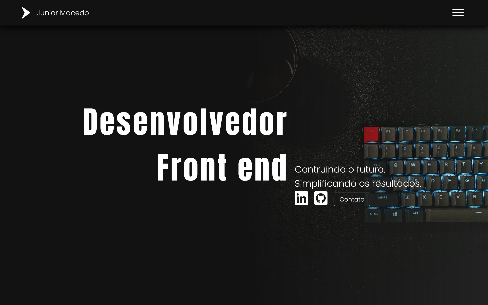
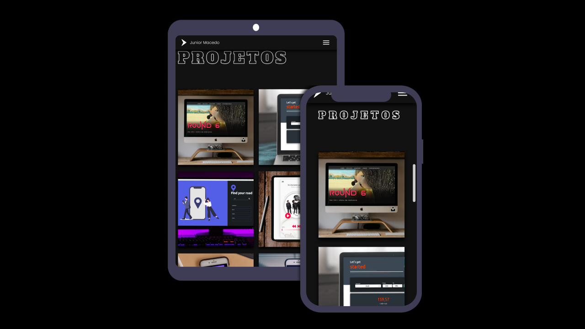

# 
 PORTFOLIO

  

# About:
This is not only my portfolio but, it is my Business Card.

I bring in a simple way all about me in each line code. Each detail can demonstrate my personality, the way how I see the world and technology, and how I like to develop applications.

> This project was developed as part of a mentoring by Conquiste sua vaga

## Scrolling down website, you're gonna see: 
- A minimalist design;
- A little bit about me;
- The last projects;

## Features:
- [x] Links to access all repositories and linkedin;
- [x] Form to get in touch( Still building);
- [x] Responsive layout;
- [x] Close menu mobile;
- [x] Full Page Scroll;
- [ ] Scroll animation;

## Javascript main challenges:

## CSS main challenges:

- Improve Sass structure, avoinding code repeated;
- Create a grid layout, to focus on more about how it works;
- Create a responsive layout;
- Learn a simple way of make a page transition with scroll-behavior;

## Responsive layout:

  

  
## Skills:

